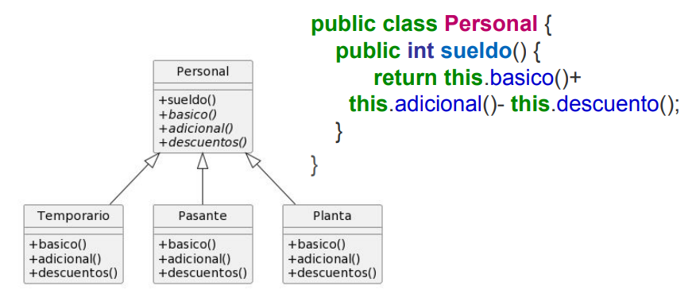

# Ejercicio 2

**Diseño:**

Para calcular el sueldo de los empleados necesitamos realizar la siguiente cuenta:

> sueldoBasico + adicionales - descuentos
> 

**Casos posibles**:

Como descuentos se calcula igual para los 3 tipos de empleados, realizamos pull up method.

> Utilizaremos el patron “Template method” ya que para calcular el sueldo necesitamos que el metodo devuelva: “sueldoBasico + adicionales - descuentos”
>