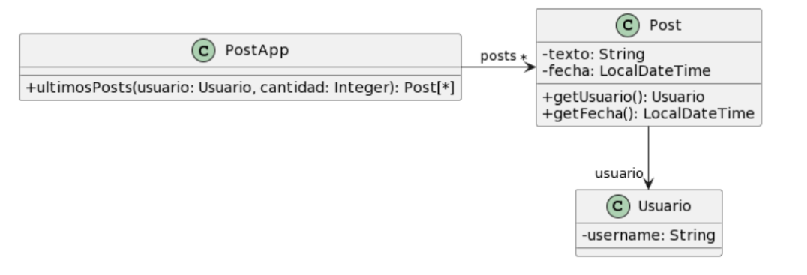

# Ejercicio 2

Para cada una de las siguientes situaciones, realice en forma iterativa los siguientes pasos:

(i) indique el mal olor,

(ii) indique el refactoring que lo corrige,

(iii) aplique el refactoring, mostrando el resultado final (código y/o diseño según corresponda).

Si vuelve a encontrar un mal olor, retorne al paso (i).

## 2.1 Empleados

```jsx
public class EmpleadoTemporario {
    public String nombre;
    public String apellido;
    public double sueldoBasico = 0;
    public double horasTrabajadas = 0;
    public int cantidadHijos = 0;
    // ......
    
		public double sueldo() {
			return this.sueldoBasico
				+ (this.horasTrabajadas * 500) 
				+ (this.cantidadHijos * 1000) 
				- (this.sueldoBasico * 0.13);
		}
}
```

```jsx
public class EmpleadoPlanta {
    public String nombre;
    public String apellido;
    public double sueldoBasico = 0;
    public int cantidadHijos = 0;
    // ......
    
    public double sueldo() {
        return this.sueldoBasico 
					+ (this.cantidadHijos * 2000)
					- (this.sueldoBasico * 0.13);
    }
}
```

```java
public class EmpleadoPasante {
    public String nombre;
    public String apellido;
    public double sueldoBasico = 0;
    // ......
    
    public double sueldo() {
        return this.sueldoBasico - (this.sueldoBasico * 0.13);
    }
}
```

### Code smells

1. Duplicated code

```java
public class EmpleadoTemporario {
    public String nombre;
    public String apellido;
    public double sueldoBasico = 0;
    public double horasTrabajadas = 0;
    public int cantidadHijos = 0;
```

```java
public class EmpleadoPlanta {
    public String nombre;
    public String apellido;
    public double sueldoBasico = 0;
    public int cantidadHijos = 0;
```

```java
public class EmpleadoPasante {
    public String nombre;
    public String apellido;
    public double sueldoBasico = 0;
```

 

### Solucion:

- Muevo estos atributos a una superclase abstracta Empleado

```java
public abstract class Empleado{
		public String nombre;
    public String apellido;
    public double sueldoBasico = 0;
}
```

```java
public class EmpleadoTemporario extends Empleado{
    public double horasTrabajadas = 0;
    public int cantidadHijos = 0;
    // ......
    
		public double sueldo() {
			return this.sueldoBasico
				+ (this.horasTrabajadas * 500) 
				+ (this.cantidadHijos * 1000) 
				- (this.sueldoBasico * 0.13);
		}
}
```

```java
public class EmpleadoPlanta extends Empleado{
    public int cantidadHijos = 0;
    // ......
    
    public double sueldo() {
        return this.sueldoBasico 
					+ (this.cantidadHijos * 2000)
					- (this.sueldoBasico * 0.13);
    }
}
```

```java
public class EmpleadoPasante extends Empleado{
    // ......
    
    public double sueldo() {
        return this.sueldoBasico - (this.sueldoBasico * 0.13);
    }
}
```

### Code smells

1. Atributos publicos en la clase abstracta Empleado, EmpleadoPlanta y EmpleadoTemporario. Esto viola el encapsulamiento de las variables.

### Solucion

- Pasarlas a privadas/protected (esto altera el comportamiento).

```java
public abstract class Empleado{
		private String nombre;
    private String apellido;
    protected double sueldoBasico = 0;
}
```

```java
public class EmpleadoTemporario extends Empleado{
    private double horasTrabajadas = 0;
    private int cantidadHijos = 0;
    // ......
    
		public double sueldo() {
			return this.sueldoBasico
				+ (this.horasTrabajadas * 500) 
				+ (this.cantidadHijos * 1000) 
				- (this.sueldoBasico * 0.13);
		}
}
```

```java
public class EmpleadoPlanta extends Empleado{
    private int cantidadHijos = 0;
    // ......
    
    public double sueldo() {
        return this.sueldoBasico 
					+ (this.cantidadHijos * 2000)
					- (this.sueldoBasico * 0.13);
    }
}
```

```java
public class EmpleadoPasante extends Empleado{
    // ......
    
    public double sueldo() {
        return this.sueldoBasico - (this.sueldoBasico * 0.13);
    }
}
```

### Code smells

1. Duplicated code en el metodo sueldo la sentencia “- (this.sueldoBasico * 0.13);”de las 3 clases hijas de Empleado

```java
public double sueldo() {
			return this.sueldoBasico
				+ (this.horasTrabajadas * 500) 
				+ (this.cantidadHijos * 1000) 
				- (this.sueldoBasico * 0.13);
		}
```

```java
public double sueldo() {
        return this.sueldoBasico 
					+ (this.cantidadHijos * 2000)
					- (this.sueldoBasico * 0.13);
    }
```

```java
public double sueldo() {
        return this.sueldoBasico - (this.sueldoBasico * 0.13);
 }
```

### Solucion

- Extract Method

```java
public abstract class Empleado{
		private tring nombre;
    private String apellido;
    protected double sueldoBasico = 0;
}
```

```java
public class EmpleadoTemporario extends Empleado{
    private double horasTrabajadas = 0;
    private int cantidadHijos = 0;
    // ......
    
    public double descuentoAportes (){
	    return this.sueldoBasico * 0.13;
    }
    
		public double sueldo() {
			return this.sueldoBasico
				+ (this.horasTrabajadas * 500) 
				+ (this.cantidadHijos * 1000) 
				- this.descuentoAportes();
		}
}
```

```java
public class EmpleadoPlanta extends Empleado{
    private int cantidadHijos = 0;
    // ......
    
    public double descuentoAportes (){
	    return this.sueldoBasico * 0.13;
    }
    
    public double sueldo() {
        return this.sueldoBasico 
					+ (this.cantidadHijos * 2000)
					- this.descuentoAportes();
    }
}
```

```java
public class EmpleadoPasante extends Empleado{
    // ......
    
    public double descuentoAportes (){
	    return this.sueldoBasico * 0.13;
    }
    
    public double sueldo() {
        return this.sueldoBasico - this.descuentoAportes();
    }
}
```

### Code smells

1. Codigo Repetido en las 3 subclases empleado

```java
public double descuentoAportes (){
	    return this.sueldoBasico * 0.13;
    }
```

### Solucion

- Extract method de descuentoAportes()

```java
public abstract class Empleado{
		private tring nombre;
    private String apellido;
    protected double sueldoBasico = 0;
    
 }
```

```java
public class EmpleadoTemporario extends Empleado{
    private double horasTrabajadas = 0;
    private int cantidadHijos = 0;
    // ......
    
    public double descuentoAportes (){
	    return this.sueldoBasico * 0.13;
    }

	  public double sueldoConDescuento (){
	    return this.sueldoBasico - this.descuentoAportes();
    }
    
		public double sueldo() {
			return this.sueldoConDescuento()
				+ (this.horasTrabajadas * 500) 
				+ (this.cantidadHijos * 1000) 
		}
}
```

```java
public class EmpleadoPlanta extends Empleado{
    private int cantidadHijos = 0;
    // ......
    
    public double descuentoAportes (){
	    return this.sueldoBasico * 0.13;
    }
    
    public double sueldoConDescuento (){
	    return this.sueldoBasico - this.descuentoAportes();
    }
    
    public double sueldo() {
        return this.sueldoConDescuento()
					+ (this.cantidadHijos * 2000)
					- this.descuentoAportes();
    }
}
```

```java
public class EmpleadoPasante extends Empleado{
    // ......
    
    public double descuentoAportes (){
	    return this.sueldoBasico * 0.13;
    }
    
    public double sueldoConDescuento (){
	    return this.sueldoBasico - this.descuentoAportes();
    }
    
    public double sueldo() {
        return this.sueldoConDescuento();
    }
}
```

### Code smells

1. Codigo duplicado del metodo descuentoAportes() y sueldoConDescuento() de las 3 clases hijas de Empleado.

```java
public double descuentoAportes (){
	    return this.sueldoBasico * 0.13;
}

public double sueldoConDescuento (){
	    return this.sueldoBasico - this.descuentoAportes();
}  
```

### Solucion

- Pull up method de los metodos descuentoAportes() y sueldoConDescuento()

```java
public abstract class Empleado{
		private String nombre;
    private String apellido;
    protected double sueldoBasico = 0;
    
    public double descuentoAportes(){
	    return this.sueldoBasico * 0.13;
    }
    
    public double sueldoConDescuento (){
	    return this.sueldoBasico - this.descuentoAportes();
    }
}
```

```java
public class EmpleadoTemporario extends Empleado{
    private double horasTrabajadas = 0;
    private int cantidadHijos = 0;
    // ......
    
    
		public double sueldo() {
			return this.sueldoConDescuento()
				+ (this.horasTrabajadas * 500) 
				+ (this.cantidadHijos * 1000);
		}
}
```

```java
public class EmpleadoPlanta extends Empleado{
    private int cantidadHijos = 0;
    // ......
    
    
    public double sueldo() {
        return this.sueldoConDescuento();
					+ (this.cantidadHijos * 2000)
    }
}
```

```java
public class EmpleadoPasante extends Empleado{
    // ......
    
    public double sueldo() {
        return this.sueldoConDescuento();
    }
}
```

### Code smells

1. Duplicated code en la sentencia “+ (this.cantidadHijos * 1000);” del metodo sueldo en la clase EmpleadoPlanta y EmpleadoTemporario

### Solucion

- Extract method de la sentencia “+ (this.cantidadHijos * 1000);”

```java
public abstract class Empleado{
		private String nombre;
    private String apellido;
    protected double sueldoBasico = 0;
    
    public double descuentoAportes(){
	    return this.sueldoBasico * 0.13;
    }
    
    public double sueldoConDescuento (){
	    return this.sueldoBasico - this.descuentoAportes();
    }
}
```

```java
public class EmpleadoTemporario extends Empleado{
    private double horasTrabajadas = 0;
    private int cantidadHijos = 0;
    // ......
    
    public int asignacionPorHijo(){
	    return this.cantidadHijos * 1000;
    }
    
		public double sueldo() {
			return this.sueldoConDescuento()
				+ (this.horasTrabajadas * 500) 
				+ this.asignacionPorHijo();
		}
}
```

```java
public class EmpleadoPlanta extends Empleado{
    private int cantidadHijos = 0;
    // ......
    
    public int asignacionPorHijo(){
	    return this.cantidadHijos * 2000;
    }
    
    public double sueldo() {
        return this.sueldoConDescuento()
					+ this.asignacionPorHijo();
    }
}
```

```java
public class EmpleadoPasante extends Empleado{
    // ......
    
    public double sueldo() {
        return this.sueldoConDescuento();
    }
}
```

### Code smells

1. Duplicated code en las clases EmpleadoTemporario y EmpleadoPlanta

```java
public class EmpleadoTemporario extends Empleado{
    private double horasTrabajadas = 0;
    private int cantidadHijos = 0;
    // ......
    
    public int asignacionPorHijo(){
	    return this.cantidadHijos * 1000;
    }
    
		public double sueldo() {
			return this.sueldoConDescuento()
				+ (this.horasTrabajadas * 500) 
				+ this.asignacionPorHijo();
		}
}
```

```java
public class EmpleadoPlanta extends Empleado{
    private int cantidadHijos = 0;
    // ......
    
    public int asignacionPorHijo(){
	    return this.cantidadHijos * 2000;
    }
    
    public double sueldo() {
        return this.sueldoConDescuento()
					+ this.asignacionPorHijo();
    }
}
```

### Solucion

- Pull Up method del metodo asignacionPorHijo(). Convertirlo en metodo abstracto ya que se comporta de distinta formas en las distintas subclases de Empleado

```java
public abstract class Empleado{
		private String nombre;
    private String apellido;
    protected double sueldoBasico = 0;
    
    public double descuentoAportes(){
	    return this.sueldoBasico * 0.13;
    }
    
    public double sueldoConDescuento (){
	    return this.sueldoBasico - this.descuentoAportes();
    }
    
    public abstract int asignacionPorHijo();
}
```

```java
public class EmpleadoTemporario extends Empleado{
    private double horasTrabajadas = 0;
    private int cantidadHijos = 0;
    // ......
    
    public int asignacionPorHijo(){
	    return this.cantidadHijos * 1000;
    }
    
		public double sueldo() {
			return this.sueldoConDescuento()
				+ (this.horasTrabajadas * 500) 
				+ this.asignacionPorHijo();
		}
}
```

```java
public class EmpleadoPlanta extends Empleado{
    private int cantidadHijos = 0;
    // ......
    
    public int asignacionPorHijo(){
	    return this.cantidadHijos * 2000;
    }
    
    public double sueldo() {
        return this.sueldoConDescuento()
					+ this.asignacionPorHijo();
    }
}
```

```java
public class EmpleadoPasante extends Empleado{
    // ......
    
    public int asignacionPorHijo(){
	    return 0;
    }
    
    public double sueldo() {
        return this.sueldoConDescuento();
    }
}
```

### Code smell

1. Duplicated code

### Solucion

Extract method de la sentencia “(this.horasTrabajadas * 500)” de la clase EmpleadoTemporario

```java
public abstract class Empleado{
		private String nombre;
    private String apellido;
    protected double sueldoBasico = 0;
    
    public double descuentoAportes(){
	    return this.sueldoBasico * 0.13;
    }
    
    public double sueldoConDescuento (){
	    return this.sueldoBasico - this.descuentoAportes();
    }
    
    public abstract int asignacionPorHijo();
 }
```

```java
public class EmpleadoTemporario extends Empleado{
    private double horasTrabajadas = 0;
    private int cantidadHijos = 0;
    // ......
    
    public int asignacionPorHijo(){
	    return this.cantidadHijos * 1000;
    }
    
    public int calcularHorasTrabajadas(){
	    return this.horasTrabajadas * 500;
	  }
	       
		public double sueldo() {
			return this.sueldoConDescuento()
				+ this.calcularHorasTrabajadas()
				+ this.asignacionPorHijo();
		}
}
```

```java
public class EmpleadoPlanta extends Empleado{
    private int cantidadHijos = 0;
    // ......
    
    public int asignacionPorHijo(){
	    return this.cantidadHijos * 2000;
    }
    
    public double sueldo() {
        return this.sueldoConDescuento()
					+ this.asignacionPorHijo();
    }
}
```

```java
public class EmpleadoPasante extends Empleado{
    // ......
    
    public int asignacionPorHijo(){
	    return 0;
    }
    
    public double sueldo() {
        return this.sueldoConDescuento();
    }
}
```

### Code smell

1. Subo metodo calcularHorasTrabajadas() para poder llegar al patter design “Template method”

### Solucion

- Pull Up method

```java
public abstract class Empleado{
		private String nombre;
    private String apellido;
    protected double sueldoBasico = 0;
    
    public double descuentoAportes(){
	    return this.sueldoBasico * 0.13;
    }
    
    public double sueldoConDescuento (){
	    return this.sueldoBasico - this.descuentoAportes();
    }
    
    public abstract int asignacionPorHijo();
    public int calcularHorasTrabajadas();
 }
```

```java
public class EmpleadoTemporario extends Empleado{
    private double horasTrabajadas = 0;
    private int cantidadHijos = 0;
    // ......
    
    public int asignacionPorHijo(){
	    return this.cantidadHijos * 1000;
    }
    
    public int calcularHorasTrabajadas(){
	    return this.horasTrabajadas * 500;
	  }
	       
		public double sueldo() {
			return this.sueldoConDescuento()
				+ this.calcularHorasTrabajadas()
				+ this.asignacionPorHijo();
		}
}
```

```java
public class EmpleadoPlanta extends Empleado{
    private int cantidadHijos = 0;
    // ......
    
    public int asignacionPorHijo(){
	    return this.cantidadHijos * 2000;
    }
    
    public int calcularHorasTrabajadas(){
	    return 0;
	  }
    
    public double sueldo() {
        return this.sueldoConDescuento()
					+ this.asignacionPorHijo();
    }
}
```

```java
public class EmpleadoPasante extends Empleado{
    // ......
    
    public int asignacionPorHijo(){
	    return 0;
    }
    
    public int calcularHorasTrabajadas(){
	    return 0;
	  }
    
    public double sueldo() {
        return this.sueldoConDescuento();
    }
}
```

### Code smell

1. Duplicated code en el metodo sueldo de las 3 subclases de Empleado

```java
public class EmpleadoTemporario extends Empleado{
    private double horasTrabajadas = 0;
    private int cantidadHijos = 0;
    // ......
    
    public int asignacionPorHijo(){
	    return this.cantidadHijos * 1000;
    }
    
    public int calcularHorasTrabajadas(){
	    return this.horasTrabajadas * 500;
	  }
	       
		public double sueldo() {
			return this.sueldoConDescuento()
				+ this.calcularHorasTrabajadas()
				+ this.asignacionPorHijo();
		}
}
```

```java
public class EmpleadoPlanta extends Empleado{
    private int cantidadHijos = 0;
    // ......
    
    public int asignacionPorHijo(){
	    return this.cantidadHijos * 2000;
    }
    
    public int calcularHorasTrabajadas(){
	    return 0;
	  }
    
    public double sueldo() {
        return this.sueldoConDescuento()
					+ this.asignacionPorHijo();
    }
}
```

```java
public class EmpleadoPasante extends Empleado{
    // ......
    
    public int asignacionPorHijo(){
	    return 0;
    }
    
    public int calcularHorasTrabajadas(){
	    return 0;
	  }
    
    public double sueldo() {
        return this.sueldoConDescuento();
    }
}
```

### Solucion

- Pull up method del metodo sueldo()

```java
public abstract class Empleado{
		private String nombre;
    private String apellido;
    protected double sueldoBasico = 0;
    
    public double descuentoAportes(){
	    return this.sueldoBasico * 0.13;
    }
    
    public double sueldoConDescuento (){
	    return this.sueldoBasico - this.descuentoAportes();
    }
    
    public double sueldo(){
	    return this.sueldoConDescuento + this.asignacionPorHijo() + this.calcularHorasTrabajadas();
    }
    
    public abstract int asignacionPorHijo();
    public int calcularHorasTrabajadas();
 }
```

```java
public class EmpleadoTemporario extends Empleado{
    private double horasTrabajadas = 0;
    private int cantidadHijos = 0;
    // ......
    
    public int asignacionPorHijo(){
	    return this.cantidadHijos * 1000;
    }
    
    public int calcularHorasTrabajadas(){
	    return this.horasTrabajadas * 500;
	  }
}
```

```java
public class EmpleadoPlanta extends Empleado{
    private int cantidadHijos = 0;
    // ......
    
    public int asignacionPorHijo(){
	    return this.cantidadHijos * 2000;
    }
    
    public int calcularHorasTrabajadas(){
	    return 0;
	  }
}
```

```java
public class EmpleadoPasante extends Empleado{
    // ......
    
    public int asignacionPorHijo(){
	    return 0;
    }
    
    public int calcularHorasTrabajadas(){
	    return 0;
	  }
}
```

## 2.2 Juego

```jsx
public class Juego {
    // ......
    public void incrementar(Jugador j) {
        j.puntuacion = j.puntuacion + 100;
    }
    public void decrementar(Jugador j) {
        j.puntuacion = j.puntuacion - 50;
		}
}
```

```java
public class Jugador {
    public String nombre;
    public String apellido;
    public int puntuacion = 0;
}
```

### Code smells

- Feature envy en la clase Juego. La clase Juego usa al jugador para incrementar/decrementar su puntacion

### Solucion

- Move method a la clase Jugador

```jsx
public class Juego {
    // ......
    
}
```

```java
public class Jugador {
    public String nombre;
    public String apellido;
    public int puntuacion = 0;
    
    public void incrementar() {
        this.puntuacion = this.puntuacion + 100;
    }
    public void decrementar() {
        this.puntuacion = this.puntuacion - 50;
		}
}
```

### Code smells

- Lazy class. La clase Juego no tiene atributos ni comportamiento

### Solucion

- Eliminar clase

```java
public class Jugador {
    public String nombre;
    public String apellido;
    public int puntuacion = 0;
    
    public void incrementar() {
        this.puntuacion = this.puntuacion + 100;
    }
    public void decrementar() {
        this.puntuacion = this.puntuacion - 50;
		}
}
```

### Code smells

- Nombre de metodos pocos explicativos
- Variables publicas que violan el encapsulamiento

### Solucion

```java
public class Jugador {
    private String nombre;
    private String apellido;
    private int puntuacion = 0;
    
    public void incrementarPuntuacion() {
        this.puntuacion = this.puntuacion + 100;
    }
    public void decrementarPuntuacion() {
        this.puntuacion = this.puntuacion - 50;
		}
}
```

## 2.3 Publicaciones



```java
/**
* Retorna los últimos N posts que no pertenecen al usuario user
*/
public List<Post> ultimosPosts(Usuario user, int cantidad) {
        
    List<Post> postsOtrosUsuarios = new ArrayList<Post>();
    for (Post post : this.posts) {
        if (!post.getUsuario().equals(user)) {
            postsOtrosUsuarios.add(post);
        }
    }
        
   // ordena los posts por fecha
   for (int i = 0; i < postsOtrosUsuarios.size(); i++) {
       int masNuevo = i;
       for(int j= i +1; j < postsOtrosUsuarios.size(); j++) {
           if (postsOtrosUsuarios.get(j).getFecha().isAfter(
     postsOtrosUsuarios.get(masNuevo).getFecha())) {
              masNuevo = j;
           }    
       }
      Post unPost = postsOtrosUsuarios.set(i,postsOtrosUsuarios.get(masNuevo));
      postsOtrosUsuarios.set(masNuevo, unPost);    
   }
        
    List<Post> ultimosPosts = new ArrayList<Post>();
    int index = 0;
    Iterator<Post> postIterator = postsOtrosUsuarios.iterator();
    while (postIterator.hasNext() &&  index < cantidad) {
        ultimosPosts.add(postIterator.next());
    }
    return ultimosPosts;
}
```

### Code smells

- Long method

### Solucion

- Extract method

```java
public List<Post> ultimosPosts(Usuario user, int cantidad) {
	List<Post> postsOtrosUsuarios = new ArrayList<Post>();
  getPostsOtrosUsuarios(user, postsOtrosUsuarios);
  
  ordenarPostsPorFecha(postsOtrosUsuarios);
	
	List<Post> ultimosPosts = new ArrayList<Post>();
	this.filtrarUltimosPosts(cantidad, postOtrosUsuarios, ultimosPosts);
	
	return ultimosPosts;
}

public void getPostsOtrosUsuarios(Usuario user, List<Post> postsOtrosUsuarios){
	for (Post post : this.posts) {
        if (!post.getUsuario().equals(user)) {
            postsOtrosUsuarios.add(post);
        }
}

public void ordenarPostsPorFecha(List<Post> postsOtrosUsuarios){
	for (int i = 0; i < postsOtrosUsuarios.size(); i++) {
       int masNuevo = i;
       for(int j= i +1; j < postsOtrosUsuarios.size(); j++) {
           if (postsOtrosUsuarios.get(j).getFecha().isAfter(
     postsOtrosUsuarios.get(masNuevo).getFecha())) {
              masNuevo = j;
           }    
       }
      Post unPost = postsOtrosUsuarios.set(i,postsOtrosUsuarios.get(masNuevo));
      postsOtrosUsuarios.set(masNuevo, unPost);    
   }
}

public void filtrarUltimosPosts(int cantidad, List<Post> postOtrosUsuarios, List<Post> ultimosPosts){
    int index = 0;
    Iterator<Post> postIterator = postsOtrosUsuarios.iterator();
    while (postIterator.hasNext() &&  index < cantidad) {
        ultimosPosts.add(postIterator.next());
    }
    return ultimosPosts;
}

```

### Code smells

- Long method

### Solucion

- Replace temp with query

```java
public List<Post> ultimosPosts(Usuario user, int cantidad) {       
  return filtrarUltimosPosts(cantidad, ordenarPostsPorFecha(getPostsOtrosUsuarios(user)));
}

public List<Posts> getPostsOtrosUsuarios(Usuario user){
	List<Posts> postsOtrosUsuarios = new ArrayList<>();
	for (Post post : this.posts) {
        if (!post.getUsuario().equals(user)) {
            postsOtrosUsuarios.add(post);
        }
	}
	return postOtrosUsuarios;
}

public List<Post> ordenarPostsPorFecha(List<Post> postsOtrosUsuarios){
	for (int i = 0; i < postsOtrosUsuarios.size(); i++) {
       int masNuevo = i;
       for(int j= i +1; j < postsOtrosUsuarios.size(); j++) {
           if (postsOtrosUsuarios.get(j).getFecha().isAfter(
     postsOtrosUsuarios.get(masNuevo).getFecha())) {
              masNuevo = j;
           }    
       }
      Post unPost = postsOtrosUsuarios.set(i,postsOtrosUsuarios.get(masNuevo));
      postsOtrosUsuarios.set(masNuevo, unPost);    
   }
   return postsOtrosUsuarios;
}

public void filtrarUltimosPosts(int cantidad, List<Post> postOtrosUsuarios){
		List<Post> ultimosPosts = new ArrayList<>();
		int index = 0;
    Iterator<Post> postIterator = postsOtrosUsuarios.iterator();
    while (postIterator.hasNext() &&  index < cantidad) {
        ultimosPosts.add(postIterator.next());
    }
    return ultimosPosts;
}
```

### Code smells

- Los ultimos 3 metodos reinventan la rueda

### Solucion

- Aplicar herramientas que nos brinda el lenguaje (streams)

```java
public List<Post> ultimosPosts(Usuario user, int cantidad) {       
  return filtrarUltimosPosts(cantidad, ordenarPostsPorFecha(getPostsOtrosUsuarios(user)));
}

public List<Posts> getPostsOtrosUsuarios(Usuario user){
	return this.posts.stream()
                     .filter(post -> !post.getUsuario().equals(user))
                     .collect(Collectors.toList());
}

private List<Post> ordenarPostsPorFecha(List<Post> postsOtrosUsuarios) {
	return postsOtrosUsuarios.stream()
		                .sorted((post1, post2) -> post1.getFecha().compareTo(post2.getFecha()))
		                .collect(Collectors.toList());
}

public void filtrarUltimosPosts(int cantidad, List<Post> postOtrosUsuarios){
		return posts.stream()
                .limit(cantidad)
                .collect(Collectors.toList());
}
```

## 2.4 Carrito de compras


```java
public class Producto {
    private String nombre;
    private double precio;
    
    public double getPrecio() {
        return this.precio;
    }
}
```

```java
public class ItemCarrito {
    private Producto producto;
    private int cantidad;
        
    public Producto getProducto() {
        return this.producto;
    }
    
    public int getCantidad() {
        return this.cantidad;
    }

}
```

```java
public class Carrito {
    private List<ItemCarrito> items;
    
    public double total() {
			return this.items.stream()
				.mapToDouble(item -> 
					item.getProducto().getPrecio() * item.getCantidad())
				.sum();
			    }
}

```

### Code smells

- Feature envy en el metodo total de la clase Carrito

### Solucion

- Move method de getPrecio() * item.getCantidad()) a ItemCarrito

```java
public class ItemCarrito {
    private Producto producto;
    private int cantidad;
        
    public Producto getProducto() {
        return this.producto;
    }
    
    public int getCantidad() {
        return this.cantidad;
    }
    
    public double getTotal(){
		    return this.producto.getPrecio() * this.cantidad;
    }

}
```

```java
public class Carrito {
    private List<ItemCarrito> items;
    
    public double total() {
			return this.items.stream()
				.mapToDouble(item -> item.getTotal();
				.sum();
			    }
}

```

## 2.5 Envío de pedidos


```java
public class Supermercado {
   public void notificarPedido(long nroPedido, Cliente cliente) {
     String notificacion = MessageFormat.format(“Estimado cliente, se le informa que hemos recibido su pedido con número {0}, el cual será enviado a la dirección {1}”, new Object[] { nroPedido, cliente.getDireccionFormateada() });

     // lo imprimimos en pantalla, podría ser un mail, SMS, etc..
    System.out.println(notificacion);
  }
}
```

```java
public class Cliente {
   public String getDireccionFormateada() {
		 return 
			this.direccion.getLocalidad() + “, ” +
			this.direccion.getCalle() + “, ” +
			this.direccion.getNumero() + “, ” +
			this.direccion.getDepartamento()
	      ;
}
```

### Code smells

- Feature envy en el metodo getDireccionFormateada() de la clase Cliente. El metodo utiliza todas las variables de instancia de direccion, ademas, estas estan publicas por lo que puede modificar su valor y esto viola el encapsulamiento

### Solucion

- Move method

```java
public class Cliente {
   public String getDireccionFormateada() {
		 return this.direccion.toString();
}
```

```java
public class Direccion {
    public String localidad;
    public String calle;
    public int numero;
    public String departamento;
    
    public String getLocalidad() {
        return localidad;
    }

    public String getCalle() {
        return calle;
    }

    public int getNumero() {
        return numero;
    }

    public String getDepartamento() {
        return departamento;
    }

    public void setLocalidad(String localidad) {
        this.localidad = localidad;
    }

    public void setCalle(String calle) {
        this.calle = calle;
    }

    public void setNumero(int numero) {
        this.numero = numero;
    }

    public void setDepartamento(String departamento) {
        this.departamento = departamento;
    }

    @Override
    public String toString() {
        return this.localidad + ", " + this.calle  + ", " + this.numero + ", " + this.departamento;
    }
}
```

### Code smells

- Middle man. La clase cliente no realiza nada, solo invoca el metodo de direccion

### Solucion

- Remove middle man

```java
public class Supermercado {
   public void notificarPedido(long nroPedido, Direccion direccion) {
     String notificacion = MessageFormat.format(“Estimado cliente, se le informa que hemos recibido su pedido con número {0}, el cual será enviado a la dirección {1}”, new Object[] { nroPedido, direccion.toString() });

     // lo imprimimos en pantalla, podría ser un mail, SMS, etc..
    System.out.println(notificacion);
  }
}
```

```java
public class Direccion {
    public String localidad;
    public String calle;
    public int numero;
    public String departamento;
    
    public String getLocalidad() {
        return localidad;
    }

    public String getCalle() {
        return calle;
    }

    public int getNumero() {
        return numero;
    }

    public String getDepartamento() {
        return departamento;
    }

    public void setLocalidad(String localidad) {
        this.localidad = localidad;
    }

    public void setCalle(String calle) {
        this.calle = calle;
    }

    public void setNumero(int numero) {
        this.numero = numero;
    }

    public void setDepartamento(String departamento) {
        this.departamento = departamento;
    }

    @Override
    public String toString() {
        return this.localidad + ", " + this.calle  + ", " + this.numero + ", " + this.departamento;
    }
}
```

## 2.6 Películas


```java
public class Usuario {
    String tipoSubscripcion;
    // ...

    public void setTipoSubscripcion(String unTipo) {
   	 this.tipoSubscripcion = unTipo;
    }
    
    public double calcularCostoPelicula(Pelicula pelicula) {
   	 double costo = 0;
   	 if (tipoSubscripcion=="Basico") {
   		 costo = pelicula.getCosto() + pelicula.calcularCargoExtraPorEstreno();
   	 }
   	 else if (tipoSubscripcion== "Familia") {
   		 costo = (pelicula.getCosto() + pelicula.calcularCargoExtraPorEstreno()) * 0.90;
   	 }
   	 else if (tipoSubscripcion=="Plus") {
   		 costo = pelicula.getCosto();
   	 }
   	 else if (tipoSubscripcion=="Premium") {
   		 costo = pelicula.getCosto() * 0.75;
   	 }
   	 return costo;
    }
}
```

```java
public class Pelicula {
    LocalDate fechaEstreno;
    // ...

    public double getCosto() {
   	 return this.costo;
    }
    
    public double calcularCargoExtraPorEstreno(){
			// Si la Película se estrenó 30 días antes de la fecha actual, retorna un cargo de 0$, caso contrario, retorna un cargo extra de 300$
   	return (ChronoUnit.DAYS.between(this.fechaEstreno, LocalDate.now()) ) > 30 ? 0 : 300;
    }
}

```

### Code smells

- Switch statement. El metodo calcularCostoPelicula() abusa de los if else.

### Solucion

- Replace conditional with polymorphism

```java
public class Usuario {
    Subscripcion tipoSubscripcion;
    // ...

    public void setTipoSubscripcion(String unTipo) {
   	 this.tipoSubscripcion = unTipo;
    }
    
    public double calcularCostoPelicula(Pelicula pelicula) {
		   	return this.tipoSubscripcion.calcularCostoPelicula(pelicula);
    }
}
```

```java
public class Pelicula {
    LocalDate fechaEstreno;
    // ...

    public double getCosto() {
   	 return this.costo;
    }
    
    public double calcularCargoExtraPorEstreno(){
			// Si la Película se estrenó 30 días antes de la fecha actual, retorna un cargo de 0$, caso contrario, retorna un cargo extra de 300$
   	return (ChronoUnit.DAYS.between(this.fechaEstreno, LocalDate.now()) ) > 30 ? 0 : 300;
    }
}

```

```java
public interface Subscripcion(){

	public double calcularCostoPelicula(Pelicula pelicula);
}
```

```java
public class SubscripcionBasica implements Subscripcion(){
	
	@Override
	public double calcularCostoPelicula(Pelicula pelicula){
			return pelicula.getCosto() + pelicula.calcularCargoExtraPorEstreno();
	}
}

public class SubscripcionFamilia implements Subscripcion{

    @Override
    public double calcularCostoPelicula(Pelicula pelicula) {
        return (pelicula.getCosto() + pelicula.calcularCargoExtraPorEstreno()) * 0.90;
    }
}

public class SubscripcionPlus implements Subscripcion{

    @Override
    public double calcularCostoPelicula(Pelicula pelicula) {
        return pelicula.getCosto();
    }
}

public class SubscripcionPremium implements Subscripcion{

    @Override
    public double calcularCostoPelicula(Pelicula pelicula) {
        return pelicula.getCosto() * 0.75;
    }
}
```

### Code smells

- Feature envy en los metodos calcularCostoPelicula(Pelicula pelicula) de las clase SubscripcionBasica y SubscripcionFamilia.

### Solucion

- Move method

```java
public class Usuario {
    Subscripcion tipoSubscripcion;
    // ...

    public void setTipoSubscripcion(String unTipo) {
   	 this.tipoSubscripcion = unTipo;
    }
    
    public double calcularCostoPelicula(Pelicula pelicula) {
		   	return this.tipoSubscripcion.calcularCostoPelicula(pelicula);
    }
}
```

```java
public class Pelicula {
    LocalDate fechaEstreno;
    // ...

    public double getCosto() {
   	 return this.costo;
    }
    
    public double calcularCargoExtraPorEstreno(){
			// Si la Película se estrenó 30 días antes de la fecha actual, retorna un cargo de 0$, caso contrario, retorna un cargo extra de 300$
   	return (ChronoUnit.DAYS.between(this.fechaEstreno, LocalDate.now()) ) > 30 ? 0 : 300;
    }
    
    public double calcularCostoExtra(){
	    return this.getCosto() + this.calcularCargoExtraPorEstreno();
    }
}

```

```java
public interface Subscripcion(){

	public double calcularCostoPelicula(Pelicula pelicula);
}
```

```java
public class SubscripcionBasica implements Subscripcion(){
	
	@Override
	public double calcularCostoPelicula(Pelicula pelicula){
			return pelicula.calcularCostoExtra();
	}
}

public class SubscripcionFamilia implements Subscripcion{

    @Override
    public double calcularCostoPelicula(Pelicula pelicula) {
        return pelicula.calcularCostoExtra() * 0.90;
    }
}

public class SubscripcionPlus implements Subscripcion{

    @Override
    public double calcularCostoPelicula(Pelicula pelicula) {
        return pelicula.getCosto();
    }
}

public class SubscripcionPremium implements Subscripcion{

    @Override
    public double calcularCostoPelicula(Pelicula pelicula) {
        return pelicula.getCosto() * 0.75;
    }
}
```

### Code smells

- Comments en el metodo public double calcularCargoExtraPorEstreno() de la clase Pelicula.

### Solucion

- Eliminar comentarios

```java
public class Usuario {
    Subscripcion tipoSubscripcion;
    // ...

    public void setTipoSubscripcion(String unTipo) {
   	 this.tipoSubscripcion = unTipo;
    }
    
    public double calcularCostoPelicula(Pelicula pelicula) {
		   	return this.tipoSubscripcion.calcularCostoPelicula(pelicula);
    }
}
```

```java
public class Pelicula {
    LocalDate fechaEstreno;
    // ...

    public double getCosto() {
   	 return this.costo;
    }
    
    public double calcularCargoExtraPorEstreno(){
	   	return (ChronoUnit.DAYS.between(this.fechaEstreno, LocalDate.now()) ) > 30 ? 0 : 300;
    }
    
    public double calcularCostoExtra(){
	    return this.getCosto() + this.calcularCargoExtraPorEstreno();
    }
}

```

```java
public interface Subscripcion(){

	public double calcularCostoPelicula(Pelicula pelicula);
}
```

```java
public class SubscripcionBasica implements Subscripcion(){
	
	@Override
	public double calcularCostoPelicula(Pelicula pelicula){
			return pelicula.calcularCostoExtra();
	}
}

public class SubscripcionFamilia implements Subscripcion{

    @Override
    public double calcularCostoPelicula(Pelicula pelicula) {
        return pelicula.calcularCostoExtra() * 0.90;
    }
}

public class SubscripcionPlus implements Subscripcion{

    @Override
    public double calcularCostoPelicula(Pelicula pelicula) {
        return pelicula.getCosto();
    }
}

public class SubscripcionPremium implements Subscripcion{

    @Override
    public double calcularCostoPelicula(Pelicula pelicula) {
        return pelicula.getCosto() * 0.75;
    }
}
```