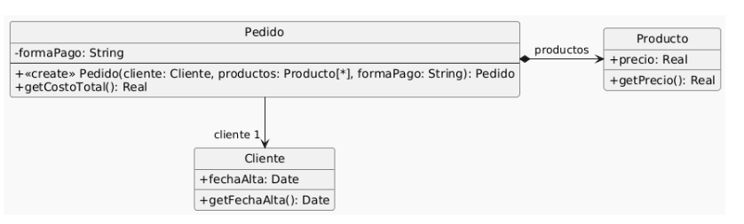

# Ejercicio 4

Se tiene el siguiente modelo de un sistema de pedidos y la correspondiente implementación.



```java
01: public class Pedido {
02:  private Cliente cliente;
03:  private List<Producto> productos;
04:  private String formaPago;
05:  public Pedido(Cliente cliente, List<Producto> productos, String formaPago) {
06:     if (!"efectivo".equals(formaPago)
07:        && !"6 cuotas".equals(formaPago)
08:        && !"12 cuotas".equals(formaPago)) {
09:          throw new Error("Forma de pago incorrecta");
10:    }
11:    this.cliente = cliente;
12:    this.productos = productos;
13:    this.formaPago = formaPago;
14:   }
15:   public double getCostoTotal() {
16:     double costoProductos = 0;
17:     for (Producto producto : this.productos) {
18:       costoProductos += producto.getPrecio();
19:     }
20:     double extraFormaPago = 0;
21:     if ("efectivo".equals(this.formaPago)) {
22:       extraFormaPago = 0;
23:     } else if ("6 cuotas".equals(this.formaPago)) {
24:       extraFormaPago = costoProductos * 0.2;
25:     } else if ("12 cuotas".equals(this.formaPago)) {
26:       extraFormaPago = costoProductos * 0.5;
27:     }
28:     int añosDesdeFechaAlta = Period.between(this.cliente.getFechaAlta(), LocalDate.now()).getYears();
29:     // Aplicar descuento del 10% si el cliente tiene más de 5 años de antiguedad
30:     if (añosDesdeFechaAlta > 5) {
31:       return (costoProductos + extraFormaPago) * 0.9;
32:     }
33:     return costoProductos + extraFormaPago;
34:   }
35: }
36: public class Cliente {
37:   private LocalDate fechaAlta;
38:   public LocalDate getFechaAlta() {
39:     return this.fechaAlta;
40:   }
41: }
42: public class Producto {
43:   private double precio;
44:   public double getPrecio() {
45:     return this.precio;
46:   }
47: }
```

### Replace loop with pipeline (16..19)

```java
01: public class Pedido {
02:  private Cliente cliente;
03:  private List<Producto> productos;
04:  private String formaPago;
05:  public Pedido(Cliente cliente, List<Producto> productos, String formaPago) {
06:     if (!"efectivo".equals(formaPago)
07:        && !"6 cuotas".equals(formaPago)
08:        && !"12 cuotas".equals(formaPago)) {
09:          throw new Error("Forma de pago incorrecta");
10:    }
11:    this.cliente = cliente;
12:    this.productos = productos;
13:    this.formaPago = formaPago;
14:   }
15:   public double getCostoTotal() {
16:     double costoProductos = 0;
17:     costoProducto = this.productos.stream()
														.mapToDouble.(p -> p.getPrecio()
														.sum();
																			
20:     double extraFormaPago = 0;
21:     if ("efectivo".equals(this.formaPago)) {
22:       extraFormaPago = 0;
23:     } else if ("6 cuotas".equals(this.formaPago)) {
24:       extraFormaPago = costoProductos * 0.2;
25:     } else if ("12 cuotas".equals(this.formaPago)) {
26:       extraFormaPago = costoProductos * 0.5;
27:     }
28:     int añosDesdeFechaAlta = Period.between(this.cliente.getFechaAlta(), LocalDate.now()).getYears();
29:     // Aplicar descuento del 10% si el cliente tiene más de 5 años de antiguedad
30:     if (añosDesdeFechaAlta > 5) {
31:       return (costoProductos + extraFormaPago) * 0.9;
32:     }
33:     return costoProductos + extraFormaPago;
34:   }
35: }
36: public class Cliente {
37:   private LocalDate fechaAlta;
38:   public LocalDate getFechaAlta() {
39:     return this.fechaAlta;
40:   }
41: }
42: public class Producto {
43:   private double precio;
44:   public double getPrecio() {
45:     return this.precio;
46:   }
47: }
```

### Replace conditional with polymorphism (21..27)

```java
01: public class Pedido {
02:  private Cliente cliente;
03:  private List<Producto> productos;
04:  private FormaDePago formaPago;
05:  public Pedido(Cliente cliente, List<Producto> productos, String formaPago) {
06:     if (!"efectivo".equals(formaPago)
07:        && !"6 cuotas".equals(formaPago)
08:        && !"12 cuotas".equals(formaPago)) {
09:          throw new Error("Forma de pago incorrecta");
10:    }
11:    this.cliente = cliente;
12:    this.productos = productos;
13:    this.formaPago = formaPago;
14:   }
15:   public double getCostoTotal() {
16:     double costoProductos = 0;
17:     costoProductos = this.productos.stream()
														.mapToDouble.(p -> p.getPrecio()
														.sum();
																			
20:     double extraFormaPago = 0;
				extraFormaDePago = this.formaPago.calcularPrecio(costoProductos);

28:     int añosDesdeFechaAlta = Period.between(this.cliente.getFechaAlta(), LocalDate.now()).getYears();
29:     // Aplicar descuento del 10% si el cliente tiene más de 5 años de antiguedad
30:     if (añosDesdeFechaAlta > 5) {
31:       return (costoProductos + extraFormaPago) * 0.9;
32:     }
33:     return costoProductos + extraFormaPago;
34:   }
35: }
36: public class Cliente {
37:   private LocalDate fechaAlta;
38:   public LocalDate getFechaAlta() {
39:     return this.fechaAlta;
40:   }
41: }
42: public class Producto {
43:   private double precio;
44:   public double getPrecio() {
45:     return this.precio;
46:   }
47: }

public interface FormaDePago(){
		public double calcularPrecio(double costoProductos);
}

public class Efectivo implements FormaDePago{

		@override
		public double calcularPrecio(double costoProductos){
				return 0;
		}
}

public class seisCuotas implements FormaDePago(){

		@override
		public double calcularPrecio(double costoProductos){
				return costoProductos * 0.2;
		}
}

public class doceCuotas implements FormaDePago(){

		@override
		public double calcularPrecio(double costoProductos){
				return costoProductos * 0.5;
		}
}
```

### Extract method y move method (28)

```java
01: public class Pedido {
02:  private Cliente cliente;
03:  private List<Producto> productos;
04:  private FormaDePago formaPago;
05:  public Pedido(Cliente cliente, List<Producto> productos, String formaPago) {
06:     if (!"efectivo".equals(formaPago)
07:        && !"6 cuotas".equals(formaPago)
08:        && !"12 cuotas".equals(formaPago)) {
09:          throw new Error("Forma de pago incorrecta");
10:    }
11:    this.cliente = cliente;
12:    this.productos = productos;
13:    this.formaPago = formaPago;
14:   }
15:   public double getCostoTotal() {
16:     double costoProductos = 0;
17:     costoProductos = this.productos.stream()
														.mapToDouble.(p -> p.getPrecio()
														.sum();
																			
20:     double extraFormaPago = 0;
				extraFormaDePago = this.formaPago.calcularPrecio(costoProductos);

28:     int añosDesdeFechaAlta = cliente.añosDeAntiguedad();
29:     // Aplicar descuento del 10% si el cliente tiene más de 5 años de antiguedad
30:     if (añosDesdeFechaAlta > 5) {
31:       return (costoProductos + extraFormaPago) * 0.9;
32:     }
33:     return costoProductos + extraFormaPago;
34:   }
35: }
36: public class Cliente {
37:   private LocalDate fechaAlta;
38:   public LocalDate getFechaAlta() {
39:     return this.fechaAlta;
40:   }
			public int añosDeAntiguedad(){
					return Period.between(this.fechaAlta, LocalDate.now()).getYears();
			}
41: }
42: public class Producto {
43:   private double precio;
44:   public double getPrecio() {
45:     return this.precio;
46:   }
47: }

public interface FormaDePago(){
		public double calcularPrecio(double costoProductos);
}

public class Efectivo implements FormaDePago{

		@override
		public double calcularPrecio(double costoProductos){
				return 0;
		}
}

public class seisCuotas implements FormaDePago(){

		@override
		public double calcularPrecio(double costoProductos){
				return costoProductos * 0.2;
		}
}

public class doceCuotas implements FormaDePago(){

		@override
		public double calcularPrecio(double costoProductos){
				return costoProductos * 0.5;
		}
}
```

### Extract method y replace temp with query (líneas 28 a 33)

```java
01: public class Pedido {
02:  private Cliente cliente;
03:  private List<Producto> productos;
04:  private FormaDePago formaPago;
05:  public Pedido(Cliente cliente, List<Producto> productos, String formaPago) {
06:     if (!"efectivo".equals(formaPago)
07:        && !"6 cuotas".equals(formaPago)
08:        && !"12 cuotas".equals(formaPago)) {
09:          throw new Error("Forma de pago incorrecta");
10:    }
11:    this.cliente = cliente;
12:    this.productos = productos;
13:    this.formaPago = formaPago;
14:   }
15:   public double getCostoTotal() {
16:     double costoProductos = 0;
17:     costoProductos = this.productos.stream()
														.mapToDouble.(p -> p.getPrecio()
														.sum();
																			
20:     double extraFormaPago = 0;
				extraFormaDePago = this.formaPago.calcularPrecio(costoProductos);
				
				return this.calcularDescuento(costoProductos, extraFormaPago);
			}

      // Aplicar descuento del 10% si el cliente tiene más de 5 años de antiguedad
			public double calcularDescuento(double costoProductos, double extraFormaDePago){
				if(this.cliente.añosDeAntiguedad(); > 5){
					return(costoProductos + extraFormaDePago) * 0.9;
				}
				return costoProductos + extraFormaDePago;
			}

36: public class Cliente {
37:   private LocalDate fechaAlta;
38:   public LocalDate getFechaAlta() {
39:     return this.fechaAlta;
40:   }
			public int añosDeAntiguedad(){
					return Period.between(this.fechaAlta, LocalDate.now()).getYears();
			}
41: }
42: public class Producto {
43:   private double precio;
44:   public double getPrecio() {
45:     return this.precio;
46:   }
47: }

public interface FormaDePago(){
		public double calcularPrecio(double costoProductos);
}

public class Efectivo implements FormaDePago{

		@override
		public double calcularPrecio(double costoProductos){
				return 0;
		}
}

public class seisCuotas implements FormaDePago(){

		@override
		public double calcularPrecio(double costoProductos){
				return costoProductos * 0.2;
		}
}

public class doceCuotas implements FormaDePago(){

		@override
		public double calcularPrecio(double costoProductos){
				return costoProductos * 0.5;
		}
}
```